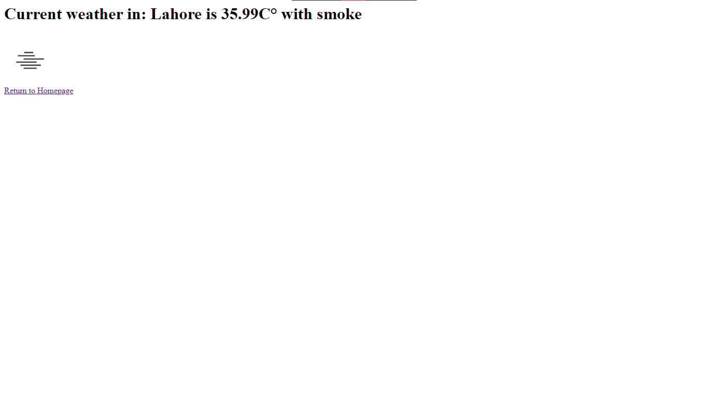
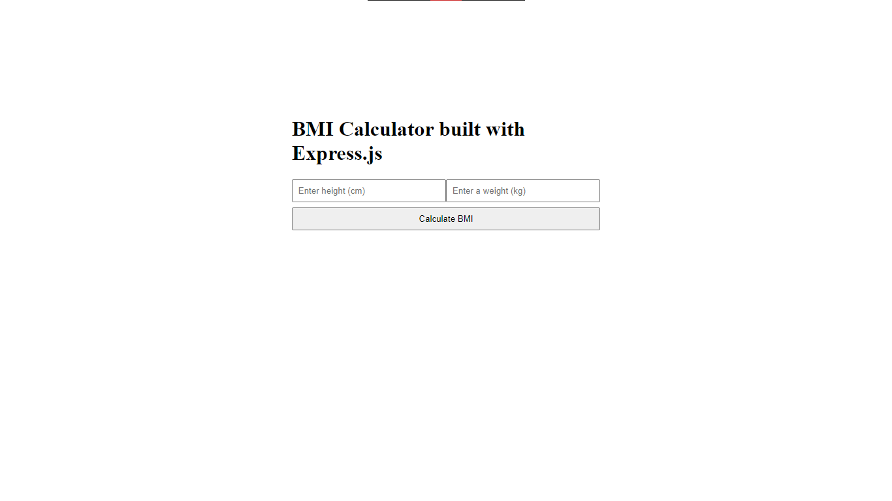
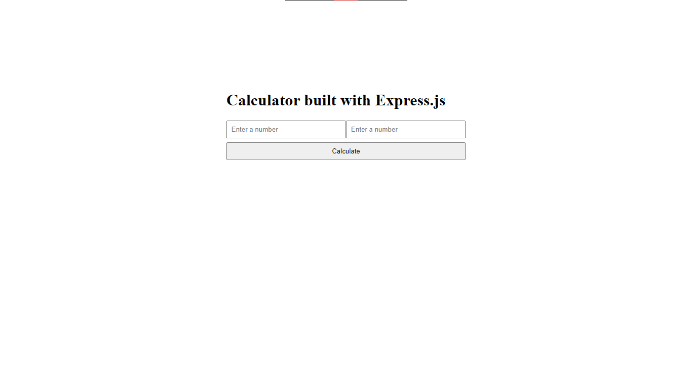

# Node.js

This repository contains all the Node.js/Express.js code I have written

# Projects

- **Weather Application**
- **BMI Calculator**
- **Simple Calculator**

## Weather Application

A simple weather application built with Express.js that takes the user input and fetches the weather data for the given user input.

## BMI Calculator

A simple Body Mass Index (BMI) calculator application built with Express.js that takes the user input and calculates their BMI as a response.

## Simple Calculator

A simple calculator application that adds 2 user input.
